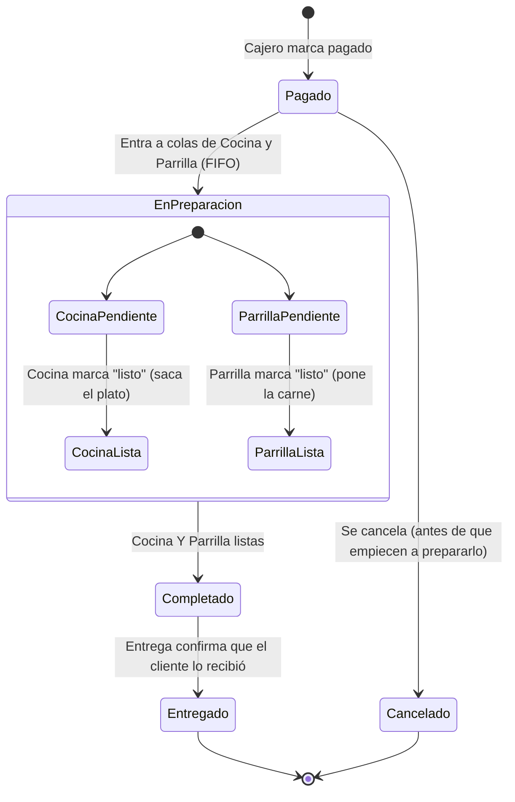
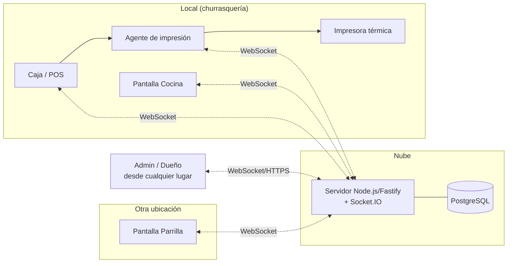

# Arquitectura — Sistema Churrasquería

## 1. Objetivo

Sistema cliente-servidor para operar una churrasquería: toma de pedidos en caja,
preparación coordinada entre cocina y parrilla (en ubicaciones físicas distintas),
y control de ganancias diarias. Todas las pantallas se actualizan **en tiempo
real** (sin F5) mediante WebSockets.

Despliegue: **nube** (accesible remoto, ver sección 9). Impresión: **térmica
ESC/POS** vía un pequeño agente local (ver sección 8).

## 2. Estaciones (clientes)

| Estación | Rol | Qué hace |
|---|---|---|
| **Caja (POS)** | Cajero | Arma el pedido desde el menú (plato + cantidad + extras), registra/asocia cliente (nombre + carnet, opcional), elige local/para llevar, marca como pagado, genera ticket digital e imprime |
| **Cocina** | Cocinero | Ve la cola de pedidos pagados en orden de llegada (FIFO), marca "listo" cuando saca el plato (guarniciones/extras) |
| **Parrilla** | Parrillero | En otra ubicación física; ve la misma cola FIFO, marca "listo" cuando pone la carne |
| **Entrega** | Encargado de entrega | Ve **todos** los pedidos desde que se pagan (con foto de cada plato, cliente/ticket/carnet o mesa destacados, y el estado de cocina/parrilla en vivo); el botón "Entregado" recién se habilita cuando cocina Y parrilla terminaron |
| **Admin / Dueño** | Administrador | Gestiona menú, precios y extras; ve ganancias del día y reportes |

Cada estación es una vista web independiente (misma app, distinta ruta/rol),
conectada al mismo servidor central.

El panel de admin (`/admin`) tiene un menú lateral (barra de tabs abajo en
celular) con: Ganancias, Pedidos, Productos, Clientes, y accesos directos a
Caja/Cocina/Parrilla/Entrega — estos cuatro últimos embeben la vista real de
esa estación en vivo, para que el admin pueda seguir cómo van las órdenes sin
necesitar una pantalla aparte.

Los botones "Listo" (cocina/parrilla) y "Entregado" (entrega) siempre piden
confirmación en un popup con el detalle del pedido antes de aplicar el
cambio — para no marcar algo por error con un toque accidental.

**Pedidos** (`/admin/pedidos`) lista todo con pestañas Pendientes / Atendidos
/ Cancelados, y permite **editar o cancelar** un pedido — solo mientras sigue
pendiente y ni cocina ni parrilla lo marcaron listo todavía (ver sección 3).
Editar reemplaza los ítems del pedido (mismo cálculo de total/parrilla que al
crearlo) y lo re-emite por WebSocket para que cocina/parrilla vean el cambio
al instante, sin recargar.

## 3. Ciclo de vida del pedido

Un pedido nace pagado en caja, avanza en dos ramas paralelas (cocina y
parrilla) y termina en la entrega al cliente:



Reglas clave:

- El pedido entra a **ambas** colas (cocina y parrilla) al mismo tiempo, apenas
  se marca pagado — cada una lo procesa de forma independiente.
- El orden dentro de cada cola es estrictamente **FIFO** por hora de pago.
- Si un pedido tiene ítems que no requieren parrilla (ej. solo bebidas o
  extras), la rama de parrilla se marca lista automáticamente para no bloquear
  el cierre del pedido.
- El pedido se considera **completado** (sale de las colas de cocina/parrilla
  y aparece en la de Entrega, ordenado por cuándo quedó listo) solo cuando
  ambas ramas están listas. Ganancias ya lo cuenta como vendido en este punto
  — la entrega es un paso logístico posterior, no afecta el reporte.
- La venta se cierra recién cuando **Entrega** confirma que el cliente recibió
  su pedido (estado `ENTREGADO`) — es el último paso del ciclo.
- Cada actualización de estado se emite por WebSocket a las pantallas
  suscritas — no hay polling ni recarga manual.
- Un pedido se puede **cancelar** (queda con estado `CANCELADO`, sale de
  ambas colas) o **editar** (cambia ítems/cliente/tipo de consumo) solo
  mientras nadie en cocina o parrilla lo marcó listo — si ya lo empezaron a
  preparar, hay que cancelarlo y cargar uno nuevo, para no generar confusión
  en planta sobre qué se está cocinando realmente.

### Módulos configurables (`/admin/configuracion`)

No todas las churrasquerías operan igual — algunas solo cobran y el mesero
se encarga de todo, otras usan cocina+parrilla completas, etc. El admin
puede habilitar/deshabilitar Cocina, Parrilla y Entrega de forma
independiente (Caja siempre está activa). Un módulo deshabilitado se trata
como "ya listo" automáticamente, y el pedido cae en cascada tan lejos como
los módulos habilitados alcancen:

`PAGADO` → (cocina y parrilla, si están habilitadas, deben marcar listo) →
`COMPLETADO` → (si Entrega está habilitada, alguien confirma la entrega a
mano; si no, se cierra solo) → `ENTREGADO`.

Ejemplo pedido explícitamente por el dueño: con solo Caja + Parrilla
habilitadas, cocina no existe para el sistema (arranca "lista" sola) y
Entrega tampoco — así que cuando el parrillero marca "Listo", ese mismo
click cierra el pedido de punta a punta. El módulo habilitado más "al final"
de la cadena siempre termina pudiendo cerrar la entrega.

## 4. Modelo de dominio

Entidades principales:

- **Producto**: nombre, categoría, precio, disponible (activo/inactivo), si
  requiere parrilla, imagen opcional (ver nota abajo).
- **Extra**: nombre, precio, imagen opcional (arroz, chorizo, papa, etc.),
  asociable a cualquier producto.
- **Configuracion**: fila única (singleton) con qué módulos están
  habilitados — `cocinaHabilitada`, `parrillaHabilitada`, `entregaHabilitada`
  (ver más abajo). Se lee/escribe desde `/admin/configuracion`.
- **Cliente**: registro real (nombre, `carnet` único opcional), gestionado
  desde `/admin/clientes` o registrado al vuelo desde caja. No es una cuenta
  con login — es solo un directorio para no re-tipear los datos de un cliente
  recurrente. El pedido igual guarda `clienteNombre`/`clienteCarnet` como
  snapshot (además de la referencia `clienteId`), para que el histórico no
  cambie si el cliente se renombra o se borra después.
- **Pedido**: folio correlativo, cliente (opcional), tipo de consumo
  (local/para llevar), **mesa** (obligatoria en caja cuando es "en local", para
  que Entrega sepa a dónde llevarlo), ítems, total, estado, cajero que lo
  cobró, timestamps por cada transición de estado.
- **ItemPedido**: producto (con snapshot de su imagen, para que cocina/
  parrilla/entrega vean la foto exacta de lo pedido), cantidad, precio unitario
  al momento de la venta,
  extras seleccionados.
- **Usuario**: cajero, cocina, parrillero, admin — rol define qué pantalla y
  qué acciones puede ejecutar.
- **CierreDiario / Venta**: agregado de pedidos completados por día, para el
  reporte de ganancias (total vendido, cantidad de pedidos, desglose por
  producto, propinas si aplica).

El precio unitario se copia al pedido en el momento de la venta (no se
referencia el precio actual del producto), para que un cambio de precio futuro
no altere el histórico de ventas.

**Imagen de producto**: se redimensiona/comprime en el navegador (canvas,
máx. ~480px, JPEG) y se guarda como *data URI* directamente en la columna
`imagenUrl` — evita depender de un bucket externo (S3/Cloudinary) que todavía
no está configurado. Es la opción correcta para el volumen actual (fotos de
platos, no un catálogo con miles de imágenes en alta resolución); si el menú
crece mucho, el paso natural es mover esto a un bucket con URL pública y
dejar `imagenUrl` como un link normal, sin cambiar el modelo.

## 5. Stack técnico recomendado

**TypeScript de punta a punta** (backend y frontend), para compartir tipos del
dominio (Pedido, Producto, etc.) entre ambos y evitar bugs de contrato
API/UI — importante en un sistema con varias pantallas que dependen de la
misma forma de datos en tiempo real.

| Capa | Elección | Por qué |
|---|---|---|
| Backend | **Node.js + TypeScript**, Fastify | Rápido de desarrollar, tipado compartido con el frontend, gran ecosistema para WebSockets e impresión ESC/POS |
| Tiempo real | **Socket.IO** | Reconexión automática, salas (rooms) por estación — ideal para "todos en Cocina ven esto, todos en Parrilla ven aquello" |
| Base de datos | **PostgreSQL** (gestionada: Neon/Supabase/Railway) | Relacional, transaccional — necesario para ventas/reportes consistentes; buen soporte de agregaciones para el reporte de ganancias |
| ORM | **Prisma** | Migraciones versionadas, tipos generados automáticamente desde el schema |
| Frontend | **React + TypeScript + Vite**, TailwindCSS | Pantallas por estación como rutas independientes; Tailwind da consistencia visual rápida en pantallas tipo "display" (cocina/parrilla) |
| Validación compartida | **Zod** | Mismos schemas para validar en API y tipar en frontend |
| Auth | JWT simple por estación/usuario, roles (cajero, cocina, parrilla, admin) | Cada estación inicia sesión una vez (kiosko) y queda autorizada solo para sus acciones |
| Monorepo | **pnpm workspaces**: `apps/server`, `apps/web`, `packages/shared` | Código de dominio y tipos compartidos sin duplicar |

### Autenticación y dominios

- **Una cuenta por estación, no por empleado**: `cocina` y `parrilla` inician
  sesión una sola vez en su tablet/PC (modo kiosko) y quedan logueados todo el
  turno. No hay login/logout por cada cocinero o parrillero que entra a
  trabajar.
- **Un solo dominio**, sin subdominios por estación. Las estaciones se
  diferencian por ruta (`/caja`, `/cocina`, `/parrilla`, `/admin`), y el rol
  del usuario logueado determina qué ruta puede ver — validado en el
  servidor, no solo ocultando botones en el frontend. Un solo dominio implica
  un solo despliegue, un solo certificado SSL y un solo proyecto en el
  hosting; no hay necesidad de multi-tenant aquí porque es un solo negocio.

### Diseño responsive (móvil)

Todas las pantallas deben ser usables desde celular, no solo desktop/tablet —
Tailwind es mobile-first por defecto, así que el trabajo es diseñar cada
vista pensando primero en pantalla chica y expandir con breakpoints
(`sm:`, `md:`, `lg:`), no al revés.

- **Caja**: layout de una sola columna en celular (menú → carrito → cobrar
  apilados), y en pantallas más grandes (tablet/desktop) se acomoda en
  columnas lado a lado. Botones grandes, pensados para dedo, no para mouse.
- **Cocina / Parrilla**: normalmente en una tablet o monitor fijo en la
  estación, pero la misma vista debe verse bien en celular por si un día hay
  que cubrir la estación con un teléfono.
- **Admin**: es la que más se va a abrir desde celular (el dueño revisando
  ganancias fuera del local) — los reportes y gráficos deben apilarse en
  columna única en pantallas chicas.
- No se planea una app nativa: al ser responsive y servido por HTTPS, se
  puede además configurar como **PWA** (instalable, ícono en el home del
  celular) sin costo extra de desarrollo — queda como mejora simple de Fase
  1, no requiere stack adicional.

Alternativas descartadas: Python/FastAPI es igual de válido en backend, pero
Node/TS evita cambiar de lenguaje entre back y front, lo cual pesa más en un
sistema con 4 pantallas distintas sincronizadas en tiempo real y lógica de
impresión ESC/POS (ecosistema JS más maduro ahí).

## 6. Eventos en tiempo real (WebSocket)

El servidor emite eventos por "sala" (room) según estación/rol:

| Evento | Emitido a | Cuándo |
|---|---|---|
| `pedido:nuevo` | cocina, parrilla | al marcar pagado en caja |
| `pedido:cocina_lista` | parrilla, caja, admin | cocina marca listo |
| `pedido:parrilla_lista` | cocina, caja, admin | parrilla marca listo |
| `pedido:completado` | cocina, parrilla, caja | ambas ramas listas → se quita de las colas |
| `menu:actualizado` | caja | admin cambia precios/disponibilidad |
| `venta:registrada` | admin | pedido completado, para el dashboard de ganancias en vivo |

## 7. API (resumen REST, complementaria al WS)

- `GET /menu` — productos y extras activos
- `POST /pedidos` — crear pedido pagado (caja)
- `GET /pedidos?estado=cocina|parrilla` — cola FIFO por estación (carga inicial; luego WS mantiene sincronía)
- `PATCH /pedidos/:id/cocina-lista`
- `PATCH /pedidos/:id/parrilla-lista`
- `GET /reportes/ganancias?fecha=` — total del día, por producto, por tipo de consumo
- `GET/POST/PATCH /admin/menu` — CRUD de productos y extras

## 8. Impresión de tickets — implementado (`apps/print-agent`)

El servidor vive en la nube, pero la impresora térmica está físicamente junto
a la caja — un navegador no puede hablarle directo a una impresora ESC/POS por
USB/red de forma confiable. Solución implementada:

1. Al marcar pagado, el servidor genera el ticket (JSON con folio, ítems,
   extras, total, cliente, tipo de consumo), lo muestra como **ticket digital
   en pantalla** siempre (esto no depende de la impresora), y emite el evento
   `ticket:imprimir` por WebSocket.
2. **`apps/print-agent`** — proceso Node pequeño que corre en la PC de caja,
   se loguea con una cuenta dedicada (rol `impresora`, ver seed), se conecta
   por WebSocket y escucha `ticket:imprimir`. Arma el ticket con un builder
   ESC/POS propio (`src/escpos.ts` — sin dependencias nativas) y lo envía a
   uno de dos destinos (`PRINTER_SINK` en su `.env`):
   - `tcp` — impresora térmica real, por red/LAN, protocolo ESC/POS crudo al
     puerto 9100 (estándar de facto que soportan casi todas las impresoras
     térmicas con Ethernet/WiFi, o un adaptador USB-a-red).
   - `file` — modo de prueba sin hardware: escribe cada ticket en
     `TICKETS_DIR` (texto legible + bytes ESC/POS crudos), útil para
     desarrollar y verificar el flujo antes de tener la impresora física.
   Reintenta 3 veces con backoff si el envío falla.
3. Si el agente/impresora no responde, el ticket digital sigue disponible y
   caja tiene un botón **"Reimprimir térmica"** (`POST
   /pedidos/:id/reimprimir`) que reenvía el mismo evento — el cobro nunca
   depende de que la impresora funcione.

Puesta en marcha: `cp apps/print-agent/.env.example apps/print-agent/.env` y
`pnpm dev:print-agent` (ver `README.md`). Corre por separado del servidor —
en la práctica va en la PC de caja, no en el hosting de la nube.

## 9. Topología de despliegue



Implementado como: un VPS propio corriendo Docker Compose — Postgres,
servidor (Fastify) y Caddy (sirve la web estática + proxy reverso + HTTPS
automático) en el mismo host, ver sección 14. (Railway/Render/Fly.io +
Neon/Supabase/Vercel eran alternativas evaluadas, pero se optó por un VPS
propio con despliegue automático vía GitHub Actions.)

## 10. Estructura de carpetas

```
sistema-churrasco/
├── apps/
│   ├── server/          # API + WebSocket + Prisma
│   │   ├── src/
│   │   │   ├── modules/pedidos, menu, reportes, auth
│   │   │   ├── ws/       # gateways de Socket.IO
│   │   │   └── prisma/schema.prisma
│   ├── web/              # React (rutas: /caja /cocina /parrilla /admin)
│   └── print-agent/      # agente de impresión térmica (corre en la PC de caja)
├── packages/
│   └── shared/           # tipos + schemas Zod compartidos
├── ARCHITECTURE.md
└── README.md
```

## 11. Reportes de ganancias

El admin necesita ver, del día actual (y consultar días anteriores):

- Total vendido y cantidad de pedidos.
- Desglose por producto y por extra.
- Desglose por tipo de consumo (local vs. para llevar).
- Actualización en vivo (`venta:registrada`) para ver el número subir sin
  refrescar.

Se calcula por agregación sobre `Pedido`/`ItemPedido` completados — no se
necesita una tabla de cierre separada al inicio; se puede materializar más
adelante si el volumen lo justifica.

## 12. Riesgos y mitigaciones

- **Dependencia de internet**: con despliegue 100% en la nube, si se cae la
  conexión del local, caja/cocina/parrilla no pueden operar. Mitigación
  recomendada a futuro: cola local de pedidos en el navegador de caja que
  sincroniza al reconectar (no incluido en el alcance inicial, queda como
  mejora).
- **Impresora offline**: cubierto en la sección 8 — el ticket digital nunca
  depende de la impresora.
- **Reconexión de pantallas**: Socket.IO reconecta solo; al reconectar, cada
  pantalla vuelve a pedir el estado actual de su cola por REST antes de
  seguir escuchando eventos, para no perder pedidos que llegaron mientras
  estaba desconectada.

## 13. Roadmap por fases

1. **Fase 1 — Núcleo del flujo** ✅: menú configurable, caja con carrito y
   marcado de pago, pantallas de cocina/parrilla con FIFO y tiempo real,
   ticket digital. Implementado y verificado de punta a punta.
2. **Fase 2 — Impresión** ✅: `apps/print-agent`, con modo de prueba sin
   hardware (`file`) y modo real por red (`tcp`, ESC/POS crudo). Ver sección 8.
3. **Fase 3 — Ganancias** ✅: dashboard de reportes en vivo para el admin.
4. **Fase 4 — Resiliencia** (pendiente, no crítico para operar hoy): cola
   offline en caja para seguir cobrando durante un corte de internet y
   sincronizar al reconectar; métricas operativas. Requiere tener el sistema
   ya en producción para priorizarlo con datos reales de uso.

### Estado de la base de datos

**PostgreSQL, tanto en desarrollo como en producción** ✅ — en desarrollo
corre en un contenedor local (`docker-compose.yml`, `pnpm db:up`); en
producción, en su propio contenedor dentro de `docker-compose.prod.yml` en el
VPS. Se migró desde SQLite (usado en las primeras fases del proyecto) porque
las pruebas de carga mostraron que el límite de un solo escritor de SQLite
se volvía un cuello de botella real bajo ráfagas concurrentes (varias
estaciones cobrando/marcando "listo" al mismo tiempo); con Postgres esas
mismas pruebas corren sin fallas y bastante más rápido. El cambio fue
puramente de configuración (`provider` en `schema.prisma` + `DATABASE_URL`),
sin tocar modelos — el schema ya estaba escrito de forma portable (sin enums
nativos de SQLite) justamente para esto.

## 14. Despliegue automático (CI/CD)

Cada merge a `main` dispara `.github/workflows/deploy.yml`: copia el código
al VPS por SSH y levanta `docker-compose.prod.yml` (Postgres + servidor +
Caddy). Caddy sirve la web estática en el dominio raíz, hace de proxy
reverso hacia el servidor en `api.<dominio>`, y saca/renueva el certificado
HTTPS solo (Let's Encrypt) sin configuración manual. Ver `README.md` sección
"Despliegue a producción" para la puesta en marcha inicial del VPS (llave
SSH dedicada, secretos de GitHub, variables de entorno).
